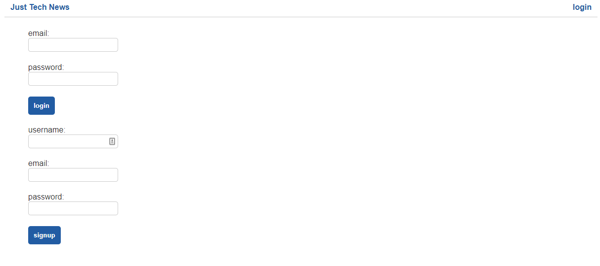
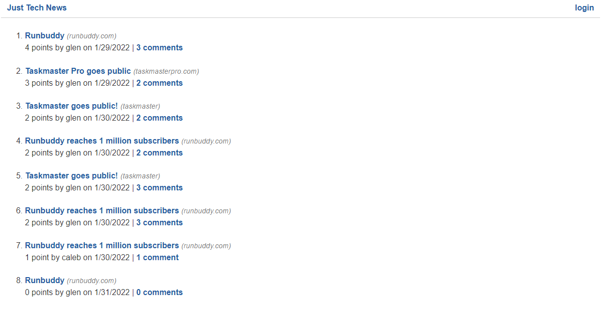
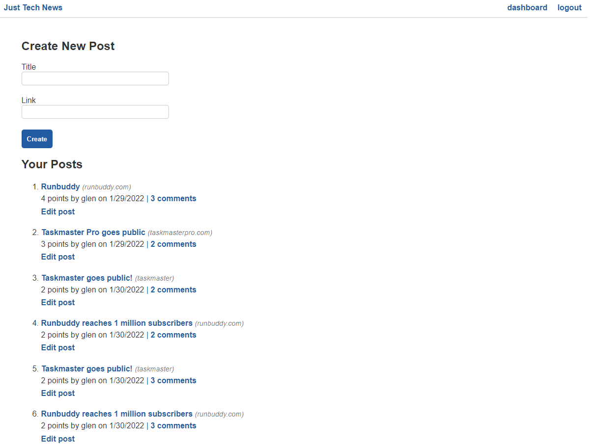
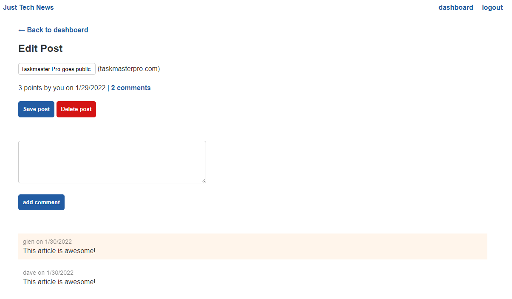

 </a>

<h3 align="center">Just Tech News</h3>

---

## 

- [About](#about)
- [Installing](#installing)
- [Usage](#usage)
- [Built With](#built_using)
- [Authors](#authors)
- [Questions](#questions)
- [Screenshots](#screenshots)

## 

Just Tech News is a full stack application that allows developers to post articles, comment on articles, and vote on articles. When a user logs in to the application they are redirected to their dashboard that displays all of their posts, comments, and votes. Users also have the ability to edit their posts from their dashboard.

## 

1. Clone the repository from GitHub.
2. Create a .env file with your MySQL credentials.
3. Run the command: npm install.
4. Start MySQL and run the command: source db/schema.sql. Exit MySQL.
5. Start the server by running the command: npm start.
6. Open the browser and navigate to http://localhost:3001/

## 

Just Tech News is a full stack application and once the server is started everything can be done via the browser.

## 

- Node.js
- Express.js
- Sequelize
- Handlebars
- CSS
- Javascript

## 

[glenluersman](https://github.com/glenluersman)

## 

- Feel free to open an issue or contact me directly at glen.luersman@gmail.com if you have any questions about the repo. You can find more of my work at [glenluersman](https://github.com/glenluersman/).

## 

</a>

</a>

</a>

</a>
